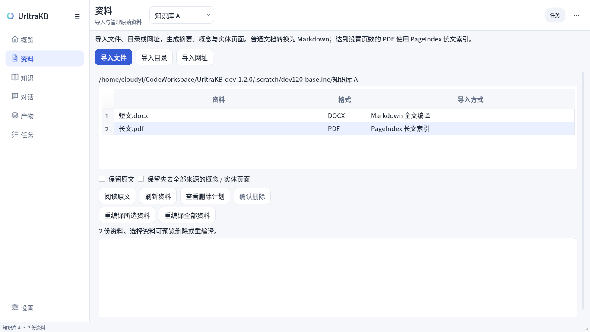
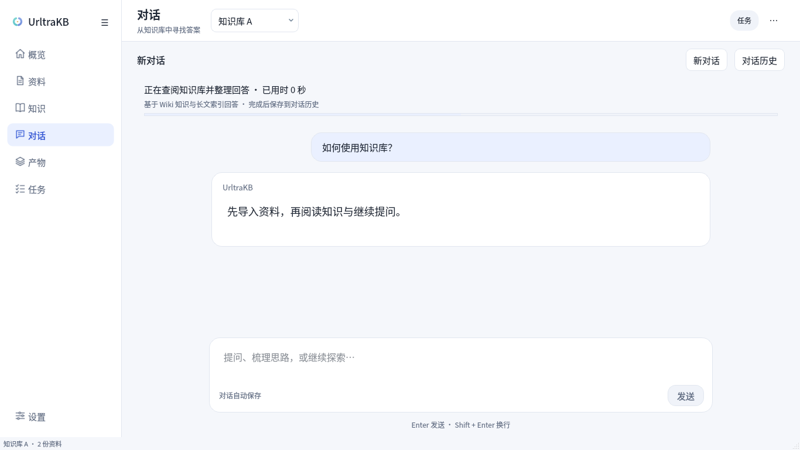

# dev-1.2.0：原始处理流程与原生桌面

本分支从最早提交 `0cec254bb2f37adff8b1af2e1bd2802ea56910ee` 创建。
桌面开发来源为任务开始时的 `dev-1.1.0`（`5547919`）。初次移植在独立
worktree 开发；随后将 `dev-1.2.0` 切换到项目主目录，移除临时 worktree。
原 `dev-1.1.0` 分支继续保留。

## 合入范围

| 范围 | 处理 |
| --- | --- |
| `0cec254..b5cdc0d`，共 51 个提交 | 移植早期桌面迁移：Qt 工作台、共享应用服务、隔离任务、锁与恢复、会话持久化、原生渲染、字体及配套构建工具 |
| 此后的桌面展示改进 | 从 `dev-1.1.0` 选择主题、概览、消息卡片、目录导航、响应式阅读、表单滚动、单实例启动与界面释放相关代码 |
| 新版文档处理和问答链路 | 不引入 OCR/原生解析替代管线、Evidence Compiler、DocumentPlan、全来源索引和答案证据审查链路 |
| 平台发布 | 保留早期桌面构建工具；本次不发布安装包，也不宣称完成 Windows/macOS 实机验收 |

核心编译提示词和 Wiki schema 保持原始版本。编译器仅保留桌面迁移所需的
配置读取、质量结果回报和共享删除辅助代码调整。CLI、REST 与桌面共享
同一套导入、查询和会话实现，Wiki 写入仍通过原有锁及事务边界。

## 页面与实际流程

- **资料**：导入文件、目录或网址。表格显示原格式以及 Markdown / PageIndex
  导入方式；“阅读原文”显示保留的 Markdown 或 PDF 逐页正文。保留重编译、
  删除预览和已完成项结果。设置里的长 PDF 起始页数决定分流，默认 20 页。
- **知识**：按摘要、概念、实体等原有 Wiki 分类阅读；单击目录切换正文。
  来源、链接、编辑草稿和冲突处理继续使用原始知识库结构。图片随窗口缩放，
  切换主题保留阅读位置。
- **对话**：继续使用 Wiki 工具及长文检索，支持历史、自动保存、继续提问、
  停止和导出。消息卡片与任务状态分开显示，不显示未实际执行的审查阶段。
- **任务与设置**：任务展示真实处理阶段与逐项结果；设置提供模型、语言、
  长 PDF 阈值、实体类型、API 地址及密钥，保留全局和当前知识库的继承关系。





## 独立环境与复验

必须使用本分支自己的依赖环境。`dev-1.1.0` 使用的
`pageindex==0.3.0.dev3+openkb.1` 修改包与本分支原始接口不兼容；这里使用
项目内 `vendor/PageIndex` 的 `v0.3.0.dev3` 源码，构建版本为
`pageindex==0.3.0.dev3+urltrakb.1`。`uv sync` 直接以 editable 模式安装本目录，
索引代码与原始 `0.3.0.dev3` 一致。来源和升级说明见
[PageIndex 源码依赖](../vendor/PageIndex/README.urltrakb.md)。

```bash
uv sync --frozen --python 3.12.13 --extra desktop --extra api --extra dev
# 首次运行时准备固定版本的本地公式/图表资源。
uv run python scripts/prepare_desktop_assets.py
uv run openkb-desktop

.venv/bin/python -m pytest -q
.venv/bin/ruff check .
.venv/bin/ruff format --check .
.venv/bin/mypy openkb

# 输出目录必须尚不存在；只调用本地受控 HTTP 模型，无需实际密钥。
QT_QPA_PLATFORM=offscreen .venv/bin/python scripts/verify_baseline_desktop.py \
  --output .scratch/baseline-acceptance
QT_QPA_PLATFORM=offscreen .venv/bin/python -m openkb.desktop.verification \
  --baseline --output .scratch/baseline-pages
```

验收脚本生成 Markdown、最小 DOCX、2 页 PDF、21 页 PDF，经过实际转换器、
PageIndex、模型 SDK、工作进程和 Qt 界面，检查导入产物、原文、去重、重编译、
URL 暂存、查询保存、两轮会话、产物导出、目录监听、任务重试与安全退出。
模型响应由本地 HTTP fixture 提供，因此验证的是链路与状态一致性，不代表
真实模型回答质量或各平台安装包验收。

本次检查的结果与环境记录在
[verification.json](desktop-evidence/dev-1.2.0/verification.json)。
以前的 `desktop-evidence` 记录属于各自注明的历史提交。
